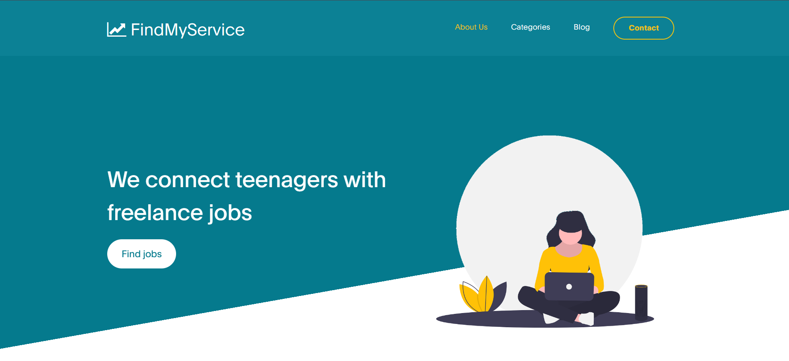
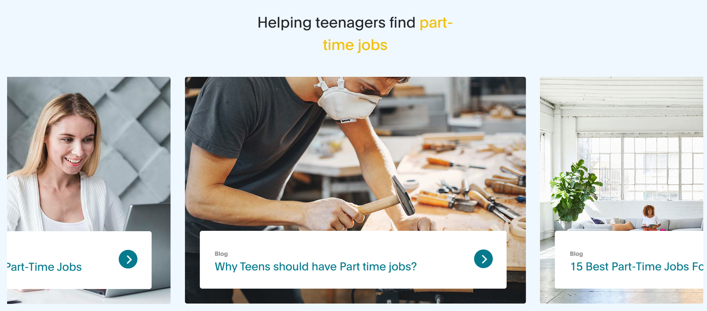
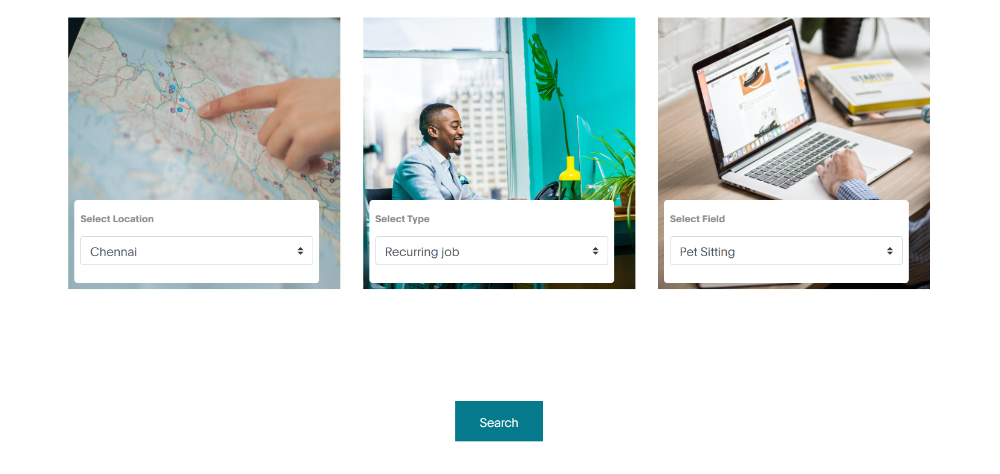
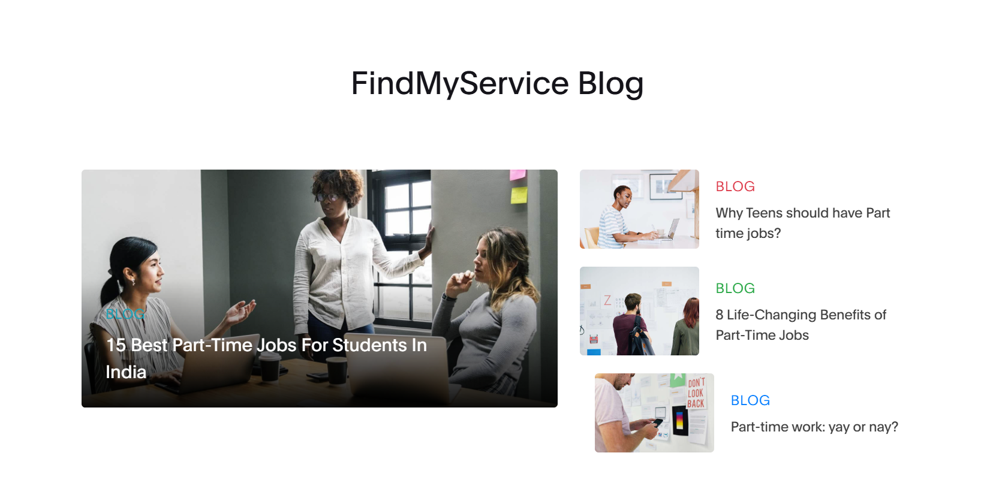
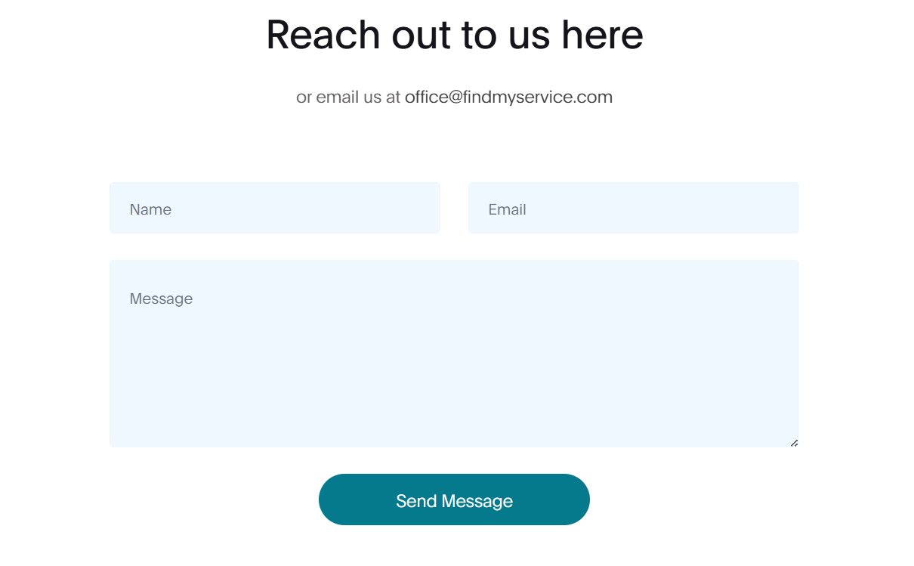

# FindMyService
Many teenagers often search for ways to get extra cash but they struggle to find good part-time jobs within their locality.
Our website connects these teens with people looking for help with their day-to-day tasks, thus benefiting both the sides.
Additionally, our website also informs parents and clients on the importance of part-time jobs for teenagers.
                         
# Tech Stack
1. HTML
2. CSS
3. JavaScript
4. MongoDB
5. ExpressDB

# How to Run
    Backend:
    Run index.js directly or run node index.js in the backend
    Frontend:
    Open live server with index.html

# Screenshots

# Team
Vaishnav D V
Priyadarshini Palanirajan

# Website template: 
[here](https://www.free-css.com/free-css-templates/page263/digital-trend)
